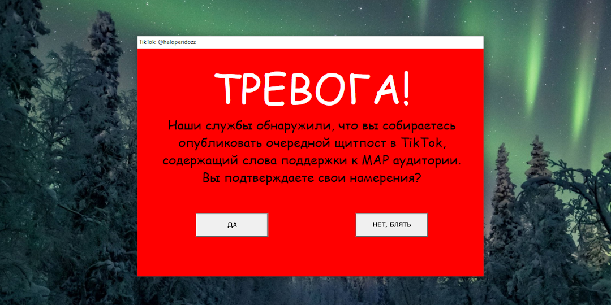
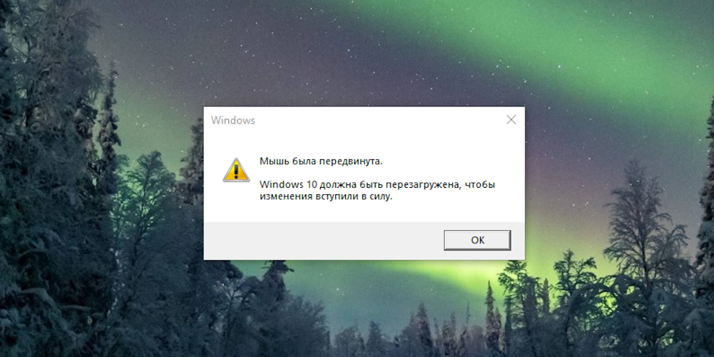

## ALERTA.EXE

|              |                                                                                                                                                                                                                                                                                                                                                                                           |
| :----------- | :---------------------------------------------------------------------------------------------------------------------------------------------------------------------------------------------------------------------------------------------------------------------------------------------------------------------------------------------------------------------------------------- |
| Name:        | ALERTA.EXE                                                                                                                                                                                                                                                                                                                                                                                |
| Description: | Creates a pop-up window with a message and two buttons, which can be customized for various purposes by modifying the source code and recompiling the project. One of the buttons cannot be clicked as it continuously "escapes" from the cursor, while the other triggers a Blue Screen of Death (BSOD). Inspired by [Trojan.Win32.Alerta](https://www.youtube.com/watch?v=Vzf5sEOvNSc). |
| Screenshot:  |                                                                                                                                                                                                                                                                                                                                                                 |
| Source Code: | [ALERTA.EXE_SRC/](ALERTA.EXE_SRC/)                                                                                                                                                                                                                                                                                                                                                        |
|              |                                                                                                                                                                                                                                                                                                                                                                                           |

## MOUSEMVD.EXE

|              |                                                                                                                                                                                                          |
| :----------- | :------------------------------------------------------------------------------------------------------------------------------------------------------------------------------------------------------- |
| Name:        | MOUSEMVD.EXE                                                                                                                                                                                             |
| Description: | Prevents the mouse from being moved and displays a dialog box. Pressing the "OK" button (e.g., via the Enter key) will force a system reboot. The program starts with a 30-second delay after execution. |
| Screenshot:  |                                                                                                                                                                              |
| Source Code: | [MOUSEMVD.EXE_SRC/](MOUSEMVD.EXE_SRC/)                                                                                                                                                                   |
|              |                                                                                                                                                                                                          |

## RECYCLE.EXE

|              |                                                           |
| :----------- | :-------------------------------------------------------- |
| Name:        | RECYCLE.EXE                                               |
| Description: | Gradually moves all desktop icons toward the Recycle Bin. |
| Screenshot:  |                                |
| Source Code: | [RECYCLE.EXE_SRC/](RECYCLE.EXE_SRC/)                      |
|              |                                                           |

## KINGVON.EXE

|              |                                                                                                                                                                                                               |
| :----------- | :------------------------------------------------------------------------------------------------------------------------------------------------------------------------------------------------------------ |
| Name:        | KINGVON.EXE                                                                                                                                                                                                   |
| Description: | [King Von Anti-Piracy Screen](https://www.tiktok.com/discover/king-von-anti-piracy). Opens a full screen window and plays the video. The window cannot be closed using keyboard shortcuts such as ALT+F4 etc. |
| Screenshot:  |                                                                                                                                                                                    |
| Source Code: | [KINGVON.EXE_SRC/](KINGVON.EXE_SRC/)                                                                                                                                                                          |
|              |                                                                                                                                                                                                               |