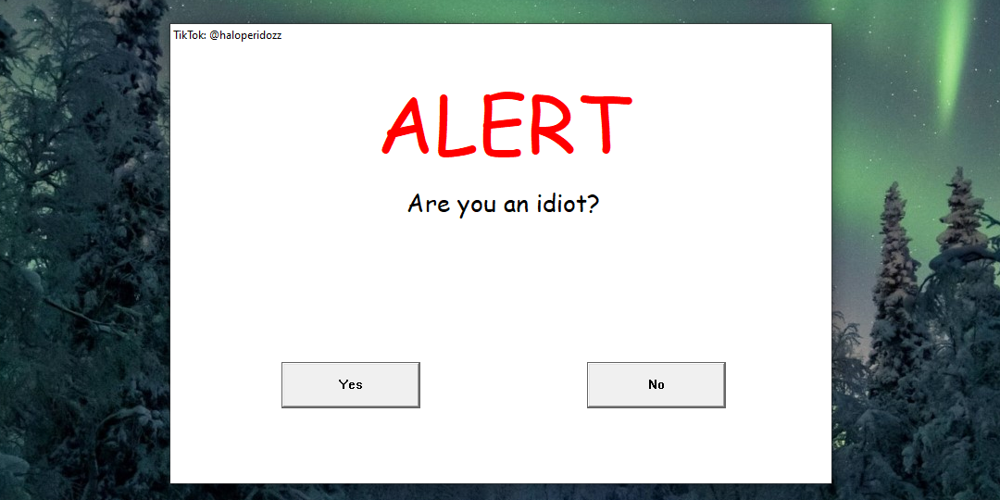

# [ALERTA.EXE](ALERTA.EXE_SRC/)

Creates a pop-up window with a message and two buttons, which can be customized for various purposes by modifying the source code and recompiling the project. One of the buttons cannot be clicked as it continuously "escapes" from the cursor, while the other triggers a Blue Screen of Death (BSOD). Inspired by [Trojan.Win32.Alerta](https://www.youtube.com/watch?v=Vzf5sEOvNSc).

# [MOUSEMVD.EXE](MOUSEMVD.EXE_SRC/)

Prevents the mouse from being moved and displays a dialog box with the following message:

> The mouse has been moved.
>
> Windows <11/10/...> must be restarted for the changes to take effect.

Pressing the "OK" button (e.g., via the Enter key) will force a system reboot. The program starts with a 30-second delay after execution.

# [RECYCLE.EXE](RECYCLE.EXE_SRC/)

Gradually moves all desktop icons toward the Recycle Bin.

# [KINGVON.EXE](KINGVON.EXE_SRC/)

[King Von Anti-Piracy Screen](https://www.tiktok.com/discover/king-von-anti-piracy). Opens a full screen window and plays the video. The window cannot be closed using keyboard shortcuts such as ALT+F4 etc.
