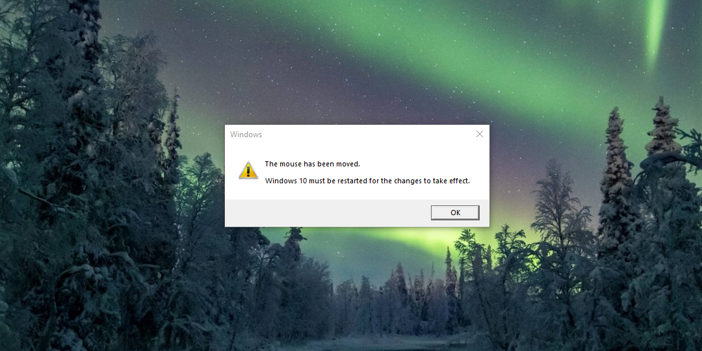

# [ALERTA.EXE](ALERTA.EXE_SRC/)

Создает окно с текстом и двумя кнопками, которое можно адаптировать под любые цели: для этого достаточно изменить исходный код и пересобрать проект. Одну из кнопок невозможно нажать, так как она будет постоянно "убегать" от курсора, а другая же вызывать синий экран смерти. [Вдохновлено Trojan.Win32.Alerta](https://www.youtube.com/watch?v=Vzf5sEOvNSc).

# [MOUSEMVD.EXE](MOUSEMVD.EXE_SRC/)

При попытке передвинуть курсор блокирует его и отображает диалоговое окно с сообщением:

> Мышь была передвинута.
> 
> Windows <11/10/...> должна быть перезагружена, чтобы изменения вступили в силу.

Нажатие на кнопку "ОК" (например, с помощью клавиши Enter) вызовет перезагрузку системы.
Программа начинает свою работу с задержкой в 30 секунд после запуска.

# [RECYCLE.EXE](RECYCLE.EXE_SRC/)

Медленно перемещает все иконки рабочего стола в сторону корзины.